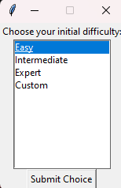
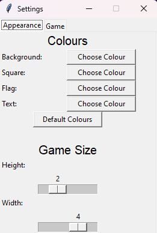
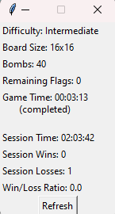

Minesweeper Game (ICS3U Final Project)
======================================

Minesweeper game built using Python and Tkinter for ICS3U, featuring custom difficulties, appearance customization, 
and save files. 
 

Difficulty Selection
--------------------
Choose a difficulty to play upon launching the program: 
 
- Easy (8x8 board, 10 bombs)
- Intermediate (16x16 board, 40 bombs)
- Expert (16x30 board, 99 bombs)
- Custom (20x40 max, at least 9 non-bomb squares)

Settings Menu
-------------
Adjust appearance and difficulty settings in the settings window: 
 
- Adjust colours for background, squares, flags, and text
- Change window dimensions and scale
- Customize board size and bomb count in `Settings > Game`

Game Stats
----------
Check your game stats in the stats window: 
 

Saving Games:
-------------
Save your games as JSON files and finish them later from `File > Save`.
- Cannot save games that have not begun or have finished
- Load a saved game from `File > Open`.

